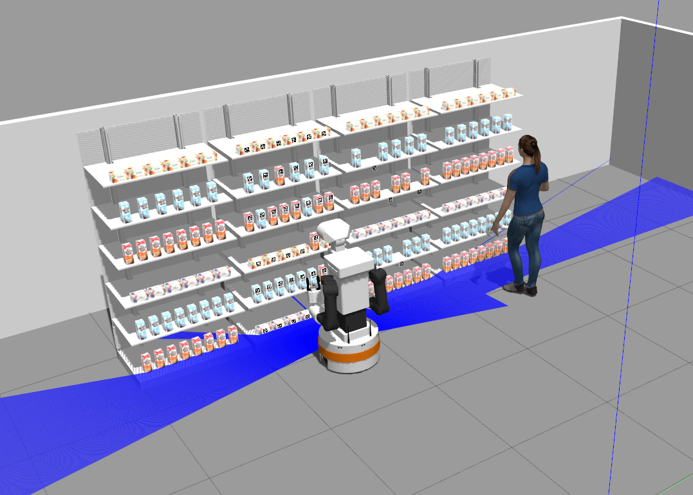

# Group 10's Multidisciplinary Project - Tiago Simulation


Welcome to the Tiago Simulation repository from Group 10! This repository contains all the packages required for running our solution.

## Table of contents

1. [Overview](#overview)
2. [Installation](#installation)
3. [Launching the project](#launching-the-project)
4. [Packages overview](#packages-overview)

## Overview

Our repository contains the packages necessary for providing a robust execution of a pick and place task for TIAGo in which the robot will take an object from a simulated checkout of a shop and take it to the corresponding shelf.

The robot will communicate when necessary with the clients via voice commands, and with the employees via a GUI. The robot also performs client avoidance and handles a number of unpredicted scenarios on its own or communicating in an quick and intuitive  manner with the employees. 

In the incoming sections we will present how to install all the required components for running our solution. After that, we will perform a short introduction to the different packages for which further information can be found within their corresponding README.

**Important:** The only officially supported Ubuntu/ROS version is Bionic/Melodic for the Tiago simulation. All dependencies with their exact remote and version are listed in the `.rosinstall`. Using this it is possible to install locally.

## Installation

We will start with the standard procedure for setting up the workspace and all the required packages.
Create a catkin workspace and clone all required dependencies listed in `cor_mdp_tiago.rosinstall`. To automate the process [vcstool](http://wiki.ros.org/vcstool) can be used:

``` bash
mkdir -p <my_catkin_ws>/src # if no catkin_ws yet
cd <my_catkin_ws>/src
git clone https://gitlab.tudelft.nl/cor/ro47007/2022/team-10/cor_mdp_tiago.git
vcs import --input cor_mdp_tiago/cor_mdp_tiago.rosinstall .
cd ..
```

Next, use rosdep to install other dependencies:
``` bash
sudo rosdep init
rosdep update
rosdep install --from-paths src --ignore-src --rosdistro melodic -y --skip-keys="opencv2 opencv2-nonfree pal_laser_filters speed_limit_node sensor_to_cloud hokuyo_node libdw-dev python-graphitesend-pip python-statsd pal_filters pal_vo_server pal_usb_utils pal_pcl pal_pcl_points_throttle_and_filter pal_karto pal_local_joint_control camera_calibration_files pal_startup_msgs pal-orbbec-openni2 dummy_actuators_manager pal_local_planner gravity_compensation_controller current_limit_controller dynamic_footprint dynamixel_cpp tf_lookup opencv3 joint_impedance_trajectory_controller" 
```
> Note: the skip-keys contain non-essential dependencies and are taken from the official [PAL install instructions](http://wiki.ros.org/Robots/TIAGo%2B%2B/Tutorials/Installation/InstallUbuntuAndROS)

Some additional steps are required for setting up rosplan for the pddl communication, in particular it is necessary to install ROSplan. The complete instructions can be found in their [website](https://github.com/KCL-Planning/ROSPlan), though the steps below are the only ones necessary for our case.

``` bash
sudo apt install flex bison freeglut3-dev libbdd-dev python-catkin-tools ros-$ROS_DISTRO-tf2-bullet

cd src/
git clone https://github.com/KCL-Planning/rosplan
cd ..
```

Additionally, two more installations are required for running the solution. One of them is the soundplay package, required for letting TIAGo talk in the simulated environment.

```bash
sudo apt-get install ros-indigo-melodic-play
```

The other one is xterm, required to launch a new terminal in the launch file of some of our packages and execute some commands for recomputing the goals of the planner.

```bash
sudo apt install xterm
```

Finally build and source the workspace:

``` bash
catkin build && source devel/setup.bash
```

## Launching the project

### Demo simulation

Start a terminal in which the main simulation will be launched
``` bash
roslaunch cor_mdp_tiago_gazebo tiago_ahold.launch tuck_arm:=true
```

Start another terminal and run:
``` bash
source devel/setup.bash
roslaunch planning_control project.launch
```

Start the third terminal 
``` bash
source devel/setup.bash
cd src/cor_mdp_tiago/retail_store_skills/planning_control/
./rosplan_executor.bash 
```

If all the installation was successful, a setup similar to the one depicted on the image below should appear on screen.



### Running final solution

Similarly to the demo simulation, we will first need to first access our workspace and after sourcing it, we need to launch the base simulation:

``` bash
roslaunch cor_mdp_tiago_gazebo tiago_ahold.launch
```

After that we will open a new terminal and run the following commands (note that depending on your bash configuration you may not need to source the environment again):

``` bash
source devel/setup.bash
roslaunch tiago_director director.launch
```

Now you can just open the GUI window and click on the 'REQUEST ORDER' button to simulate a request from the check-out.

## Packages overview

You can find below an overview of the different packages of our repository, together with a short description and link to each of the packages, in which a more extensive description can be found.

```
├── aruco_detection
├── cor_mdp_tiago_gazebo
├── custom_msgs
├── dyn_reconf_mdp
├── grocery_store_utils
├── retail_store_skills
│   ├── planning_control
│   └── tiago_example_skills
├── tiago_director
├── tiago_gui
├── tiago_tts
├── ahold_world.png
└── cor_mdp_tiago.rosinstall
```

### [aruco_detection](https://gitlab.tudelft.nl/cor/ro47007/2022/team-10/cor_mdp_tiago/-/tree/master/aruco_detection)

This package contains the code that subscribes to the aruco detections topic. Selects the product that has the highest priority. And proceeds to sending the aruco detection id to the parameter server for picking.

### [custom_msgs](https://gitlab.tudelft.nl/cor/ro47007/2022/team-10/cor_mdp_tiago/-/tree/master/custom_msgs)

This package contains the definition of the custom messages and services employed in the implementation of the system.

### [dyn_reconf_mdp](https://gitlab.tudelft.nl/cor/ro47007/2022/team-10/cor_mdp_tiago/-/tree/master/dyn_reconf_mdp)

This package contains a dynamically reconfigurable node which updates a set of parameters upon request and publishes their contents to all nodes listening to it. In this way bidirectional and efficient communication is established between nodes.

### [grocery_store_utils](https://gitlab.tudelft.nl/cor/ro47007/2022/team-10/cor_mdp_tiago/-/tree/master/grocery_store_utils)

This package was created by a PhD at AIRLab, which contains some utility servers for robotic manipulation within a grocery store, including the *collision_obstacles_server*, *grasp_pose_server* and *grocery_list_server*.

### [retail_store_skills](https://gitlab.tudelft.nl/cor/ro47007/2022/team-10/cor_mdp_tiago/-/tree/master/retail_store_skills)

This folder contains the following two packages used for planning and control skills.

#### [planning_control](https://gitlab.tudelft.nl/cor/ro47007/2022/team-10/cor_mdp_tiago/-/tree/master/retail_store_skills/planning_control)

This package contains the files needed for planning and control. The PDDL files can generate a sequence of actions given specific goals based on symbolic reasoning and send it to the action interfaces. The action interfaces are some nodes that can gather commands from PDDL and send them to the action servers to execute. The node *update_goals* can deal with the PDDL request online and modify the PDDL goals at run time. 

#### [tiago_example_skills](https://gitlab.tudelft.nl/cor/ro47007/2022/team-10/cor_mdp_tiago/-/tree/master/retail_store_skills/tiago_example_skills)

This package was provided by the course KRR, which contains  action servers for performing some skills such as *pick*, *place* and *look_to_point*.

### [tiago_director](https://gitlab.tudelft.nl/cor/ro47007/2022/team-10/cor_mdp_tiago/-/tree/master/tiago_director)

This package contains the definition of a node that executes the different actions of the system upon the commands given through the GUI or the errors encountered during execution. It will take charge of navigation the robot where needed and perform the PDDL execution for the pick and place action.

### [tiago_gui](https://gitlab.tudelft.nl/cor/ro47007/2022/team-10/cor_mdp_tiago/-/tree/master/tiago_gui)

This package contains the definition of the Graphical User Interface with which the operator will communicate with TIAGo and will receive feedback from it.

### [tiago_tts](https://gitlab.tudelft.nl/cor/ro47007/2022/team-10/cor_mdp_tiago/-/tree/master/tiago_tts)

This package contains a script that enables TIAGo to communicate by voice with users and employees.

<!--## Marker Detection

In both the Festo and Ahold world, you may notice there are some items with markers on them. You can use these markers to easily detect the pose of the items. Please have a look at [apriltag_ros](https://github.com/AprilRobotics/apriltag_ros) to get a better understanding of how to use marker detection. The apriltag detection node is already included in both launch files.

**Important:** People who have followed the course KRR (Knowledge Reasoning and Representation) are likely familiar with Aruco markers, however the detection accuracy proved insufficient. Therefore, we have opted to use a different marker detection package by default for this course, see [apriltag_ros](https://github.com/AprilRobotics/apriltag_ros). 

> Of course you are free to explore different marker detection packages, or even detection methods that don't require markers!-->
