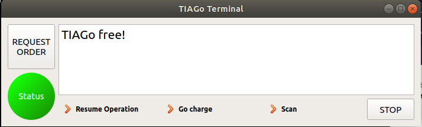

# GUI package for TIAGo

## Table of contents

1. [Overview](#overview)
2. [Package structure](#package-structure) 
3. [Usage](#usage)
4. [Testing](#testing)

## Overview

The present package contains all the necessary files for running the Graphical User Interface (GUI) used for communicating with our TIAGo simulation. The package contains the definition of a node that will handle the communication of the GUI with other ROS nodes via dynamic reconfigure client and multiple subscribers (some temporal); an example publisher for checking the correct functioning of the interface; and all the necessary components for fully defining the GUI's appearance.

## Package structure

The structure of the present package is as described in the tree below:

```
├── include
│   ├── tiago_gui
│   │   ├── my_terminal.h
│   │   ├── my_terminal.ui
│   │   └── qledlabel.h
├── launch
│   └── gui.launch
├── nodes
│   ├── talker.cpp
│   └── tiago_gui.cpp
├── src
│   ├── my_terminal.cpp
│   └── qledlabel.cpp
├── CMakeLists.txt
└── package.xml
```

## Usage

In order to launch the GUI, you can run the standalone node by running roscore in one terminal and in a new one:

```bash
rosrun tiago_gui tiago_gui
```

>**Note**: remember that you may need to source the environment in the new terminal, if not done already, for running the command.

Using roslaunch to automatically start roscore:

```bash
roslaunch tiago_gui gui.launch
```

Or make use of the launch file in the directory package to also verify the correct functioning of the emergency stop.

```bash
roslaunch tiago_director director.launch
```

On your screen the GUI should appear as in the image below:



## Testing

You can verify the correct functioning of the interface by clicking on the different buttons of the interface, which will add informative messages to the text window and switch the led colour in the former case.

**Note:** if you launched the node using *rosrun*, the START button will not make any changes unless you have a **server** node running on the background. Using roslaunch will trigger the server node automatically, enabling the change of parameters in runtime as well as the LED colour. Please look into the documentation of the **dyn_reconf_mdp** package for a more detailed description on the server node functionalities and the means for evaluating and testing it. 

You can also test send your own messages to the text box by publishing to the "/error_topic" topic:
```bash
rostopic pub /error_topic std_msgs/String "data: '<your_message_info>'"
```

Or checking that the GUI actually listens to other nodes by running the sample talker contained  within the same package:
```bash
rosrun tiago_gui talker
```

By pressing the START button, the Status LED should change to blue and the informative message "TIAGo Working!" should be displayed on screen. Additionally, the parameter "/server/order_req" should change its value to "true" (to verify this, refer to the dyn_reconf_mdp package documentation).

By pressing the "Resume" button, a similar behaviour can be observed, showing the same message as before.

By pressing the "Go to charge" or "scan" button, the Status LED will also change to blue, showing an informative message.

Finally, the STOP button will change the Status LED to red and inform the employee about the uncertain status of the robot. Additionally, it can be verified via "rosnode list" that the "rosplan" and "tiago_director" packages will have disappeared.

